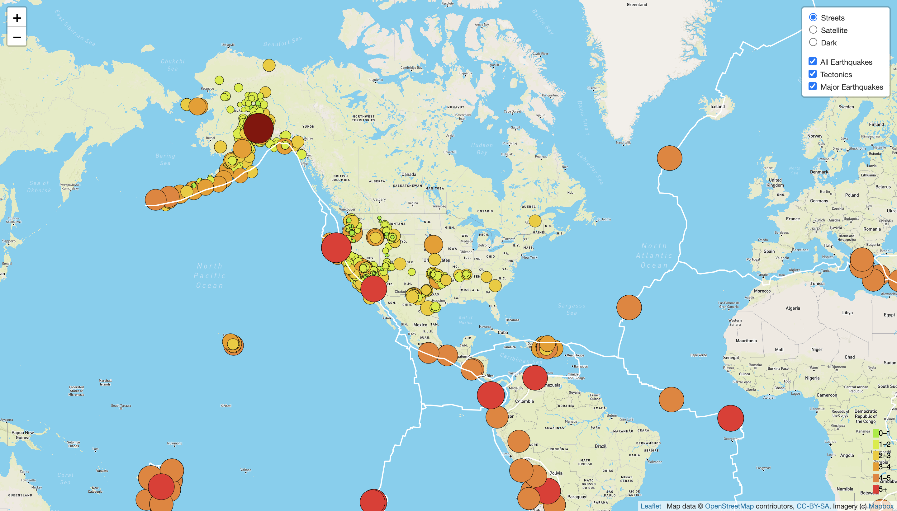

# Mapping_Earthquakes
Earthquake Mapping Project for UT Austin Data Analysis & Visualization Certificate  

## Project Overview
We were asked to build a webpage that would display a map marking locations of earthquakes across the world. We retrieved the GeoJSON data using the D3 library, then used Leaflet to build the map with a legend, pop-up markers, and multiple map style options.  

## Resources
- Data Sources: https://earthquake.usgs.gov
- Software: JavaScript, D3, Leaflet, HTML, CSS, VS Code

## Results

 

